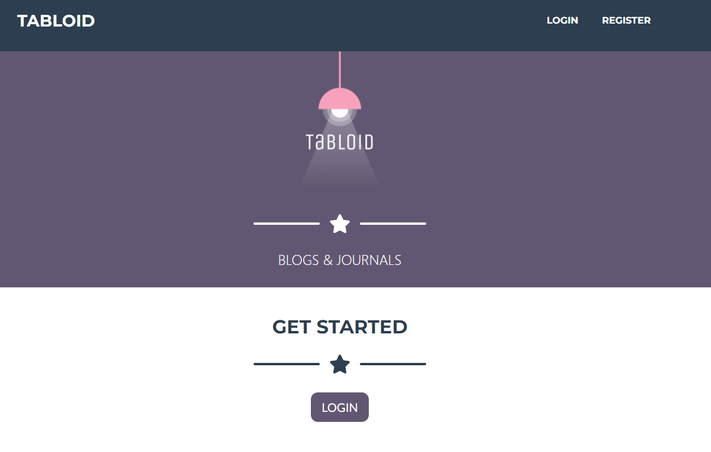
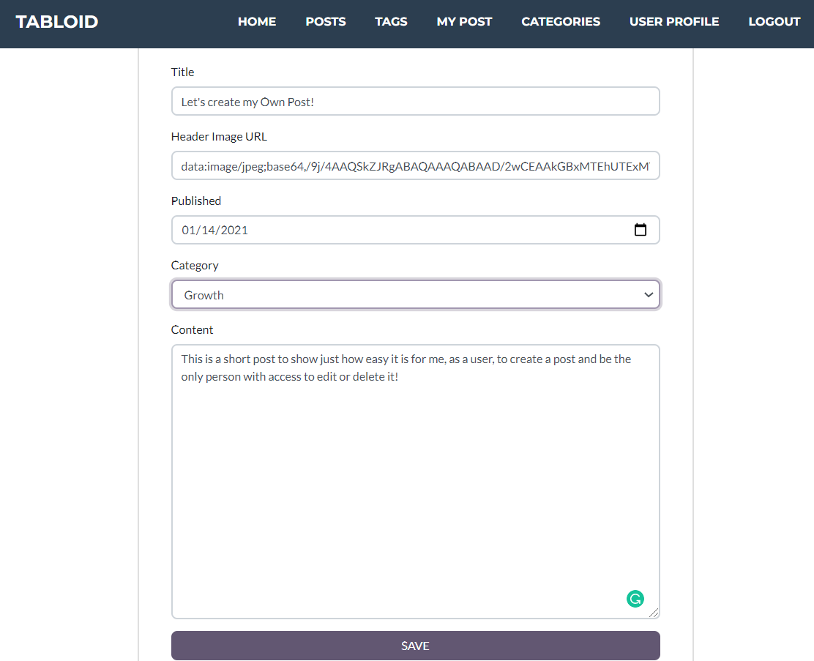
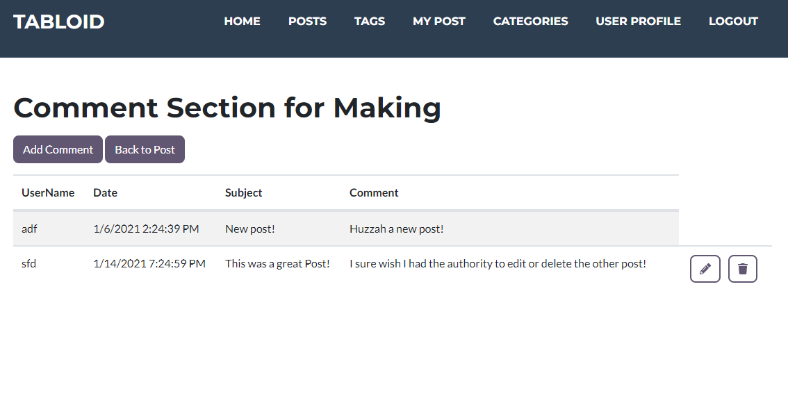
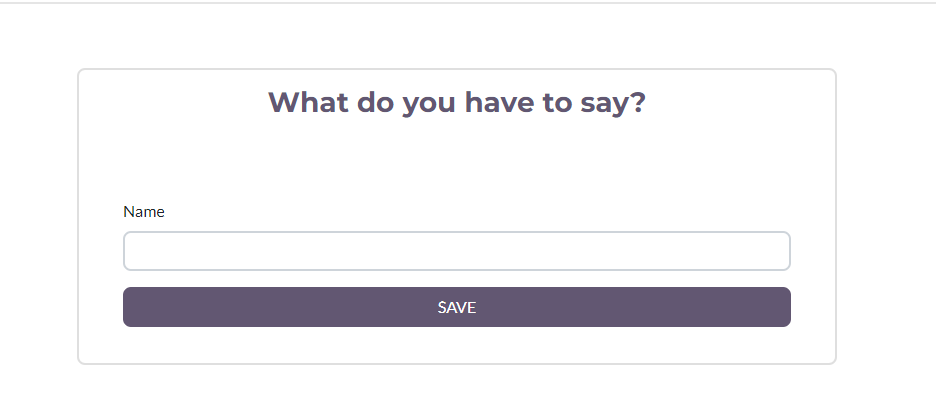

# Tabloid MVC

A website based off of Medium.com, that was created with a group of four people. The purpose of Tabloid was to utilized and level up our understanding of building an application in ASP.NET with the MVC Pattern
So it's time to pivot. We're still going to focus on long-form writing, but not we'll let people write their own posts.

## What's in it??

Full CRUD with intricate foreign key relationships found throughout the database. A Repository Pattern was created to handle all of the SQL commands which allows the users to manipulate the data. 

Models were created to represent the Data Tables for User Profiles, Posts, Comments, Tags, and categories. 

Views utlize Razor pages which combine C# and HTML, which combine to give our users a pleasant way to view data and create/manipulate items which are within their authorization

Controllers were created for each model as a way to handle request coming from the browser, and relayed back to repositories to retrieve or manipulate items. Which then return one of the views so that users have a streamlined experience for creating, reading, updating, or even deleting posts on the website.

### Users

Tabloid Has two types of users, Authors and Admis, which are limited by authorization rights:

* **Authors** can create Posts, manage their own Posts(to include editing and deleting), are prevented from making any changes to Posts which don't belong to them, and read and comment on other authors' posts

* **Admins** can do all the things authors can do, but are also in charge of managing all the data in the system. 

### ERD

### Let'stake a visual journey as an Author
#### Login

#### Creating a post

#### View once an author makes a  post
##### you'll notice the category to the right

#### An Author's view when going to add comments
##### Notice that only comments the logged in user created shows options for editing or deleting

### An Author has the same views an abilities as views as Authors, however they have no edit or delete restrictions

#### as an addition, they have the ability to add, edit, and delete categories

#### View of all categories currently in existance

    
#### View when creating a new category
